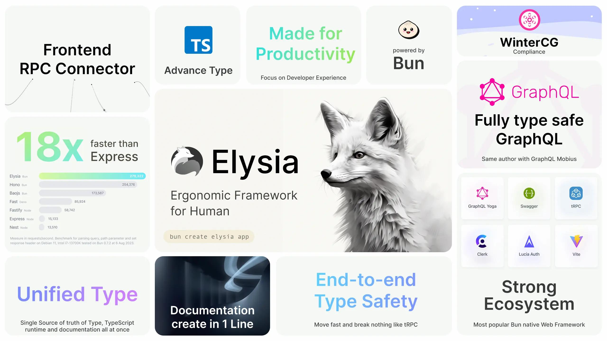

<h1 align="center">
    
</h1>

Projeto feito durante a apresentação no youtube:
-  [link do canal]()

## Introdução
No vídeo foi mostrado de maneira simples o novo framework Elysia e suas apis de trabalho junto com testes e2e.

- [bun](https://bun.sh/)
- [elysiajs](https://elysiajs.com/)

## Para usar esse projeto vc deve:

### Instalar as dependências

```bash
bun install
```

### Rodar ele
```bash
# dev
bun --watch index.ts
```

### Rodar os testes
```bash
bun test
```

